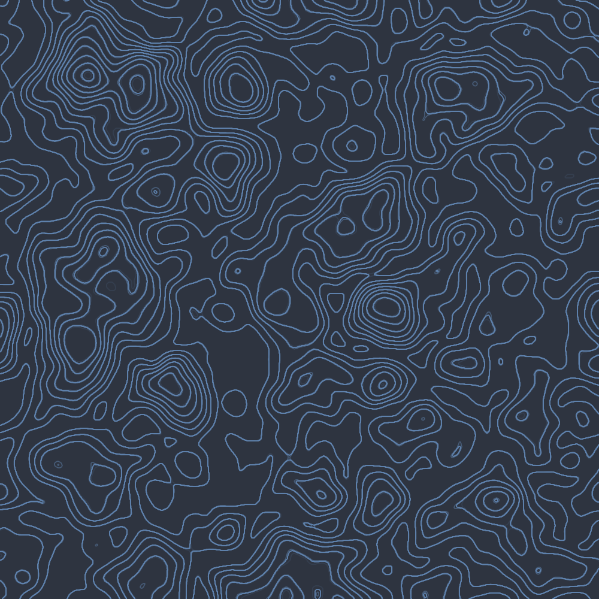
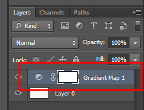
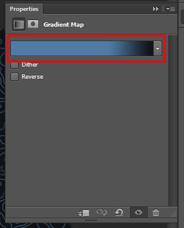
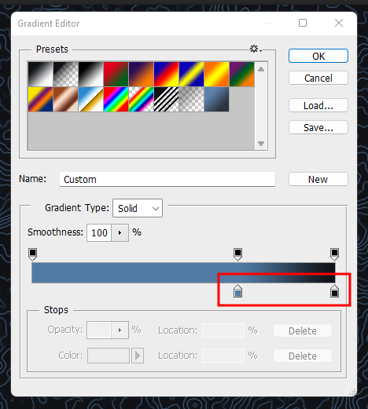

# Topographic Map Wallpapers Collections

A collection of wallpapers in various colorscheme representing the Topographic Map Style

# Create your own colorscheme

To create your own version you need `Photoshop` cause I have not found a way to achive the same in Gimp or Krita

- Open the `Project.psd` in `Photoshop`

- On the layers double click the Gradient Map

- On the properties double click on the gradient colors

- Change the color as shown in the picture below

## Extra

- Adjust the distance of the color to your liking